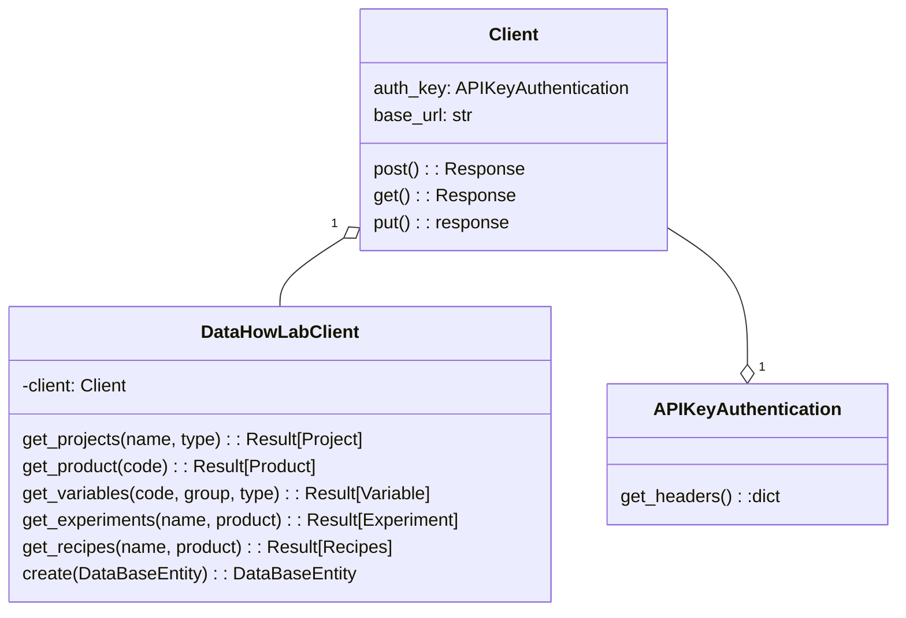
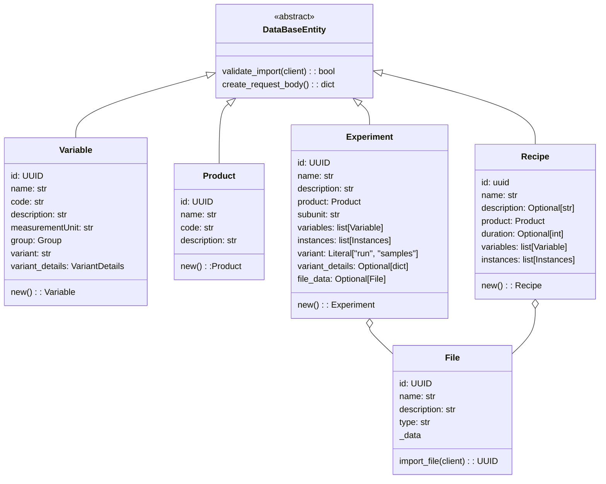

# Client Relationships

```mermaid
classDiagram
 
    Client "1" o-- DataHowLabClient
    Client --o "1" APIKeyAuthentication


    class Client {
      auth_key: APIKeyAuthentication
      base_url: str
      post(): Response
      get(): Response
      put(): response
    }

    class APIKeyAuthentication{
        get_headers():dict
    }

    class DataHowLabClient{
        -client: Client
        get_projects(name, type): Result[Project]
        get_product(code): Result[Product]
        get_variables(code, group, type): Result[Variable]
        get_experiments(name, product): Result[Experiment]
        get_recipes(name, product): Result[Recipes]
        create(DataBaseEntity): DataBaseEntity
    }

```

# DataBaseEntities

```mermaid
classDiagram

    class DataBaseEntity{
        <<abstract>>
        validate_import(client): bool
        create_request_body(): dict
    }

    DataBaseEntity <|-- Variable
    class Variable {
        id: UUID
        name: str
        code: str
        description: str
        measurementUnit: str
        group: Group
        variant: str
        variant_details: VariantDetails
        new(): Variable
    }

    DataBaseEntity <|-- Product
    class Product {
        id: UUID
        name: str
        code: str
        description: str
        new():Product
    }

    Experiment o-- File
    Recipe o-- File
    class File {
        id: UUID
        name: str
        description: str
        type: str
        _data
        import_file(client) : UUID
    }

    DataBaseEntity <|-- Experiment
    class Experiment {
        id: UUID
        name: str 
        description: str 
        product: Product 
        subunit: str 
        variables: list[Variable] 
        instances: list[Instances] 
        variant: Literal["run", "samples"] 
        variant_details: Optional[dict] 
        file_data: Optional[File] 
        new(): Experiment
    }

    DataBaseEntity <|-- Recipe
    class Recipe {
        id: uuid
        name: str 
        description: Optional[str] 
        product: Product 
        duration: Optional[int] 
        variables: list[Variable] 
        instances: list[Instances] 
        new(): Recipe
    }
```

